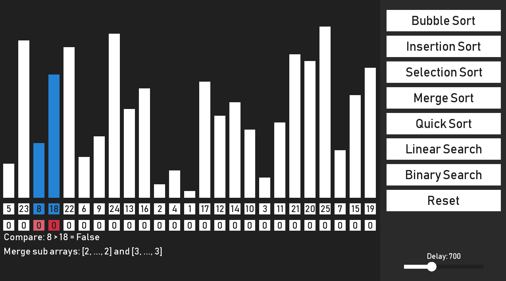

<h1 align="center">Welcome to AlgoVis</h1>

> A program that visualizes basic search and sorting algorithms.

### [Homepage](https://github.com/undefinedhuman/AlgoVis)
### [View the Demo](https://github.com/undefinedhuman/AlgoVis/releases)

## Prerequisites

- gradle v6.6.1
- Java JDK 8
- I recommend using the Intellij-IDE with activated Gradle plugin

## Installation

> This guide assumes that you already have Java + Gradle installed and can build a project with Gradle.

```sh
git clone https://github.com/undefinedhuman/AlgoVis.git
cd AlgoVis
./gradlew build
``` 

## Usage

```sh
./gradlew desktop:run

When running the project under Windows, I had to add the following line to the gradle.properties file to link my Java JDK to the project (the path may be different for other setups):
org.gradle.java.home=C:\\Program Files\\Java\\jdk1.8.0_131
```

## Bugs

- Sometimes the program crashes due to multithreading, especially if the delay is around 100-150

## Screenshots

## Author

**[Alexander Padberg](https://github.com/undefinedhuman)**


